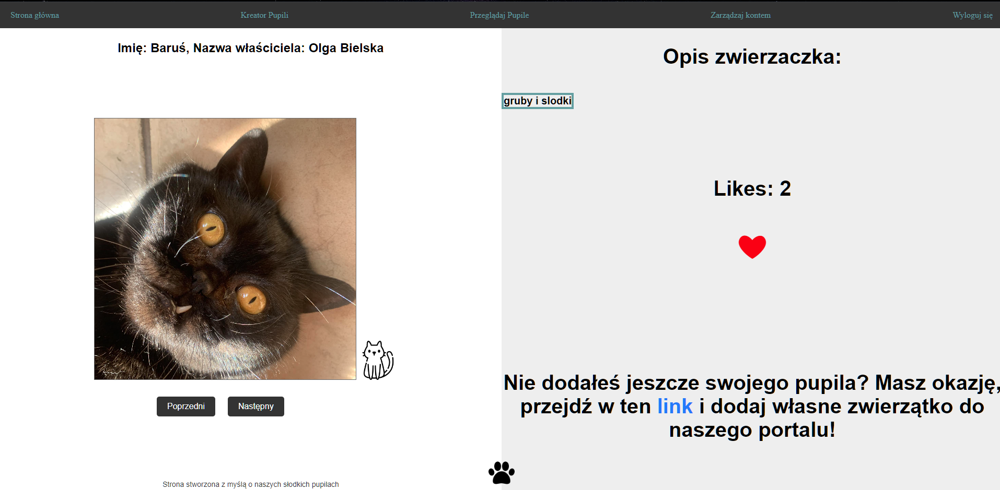

#   Pet-Tok
Pet-tok is a polish web application that allows you to share information about your pets and rate other users' pets. The app is designed to promote animal welfare and support animal shelters.

Below are screenshots of the website's appearance.
## Features
User-friendly interface for adding and managing your pets
Rating system to rate other users' pets
User authentication and user profile editing

## This project is built with:

* Java
* Spring Boot
* Hibernate
* Spring Data
* MySQL
* API

## Installation
To run the application locally, you need to:

Clone the repository
Set up a MySQL database
Configure the application.properties file
Run the application using the Spring Boot Maven plugin
For detailed instructions, please refer to the installation guide.

## Contributing
Contributions to Pet-tok are welcome! If you have suggestions for new features or find a bug, please open an issue or submit a pull request.

# 🐶🐾🐶🐱🐰

## Register page

## Home page after logging in with fun facts about animals

## Searching page on animals

## ---------------------------------------------
This project has a proper form validation, integration with the API from the website https://fajnepodroze.pl/ciekawostki-o-zwierzetach/ to retrieve fun facts about animals, hashing of the page path, session-based login, browsing other users' pets, saving and reading images to/from the computer, and correct password recovery using a code sent in an email message.